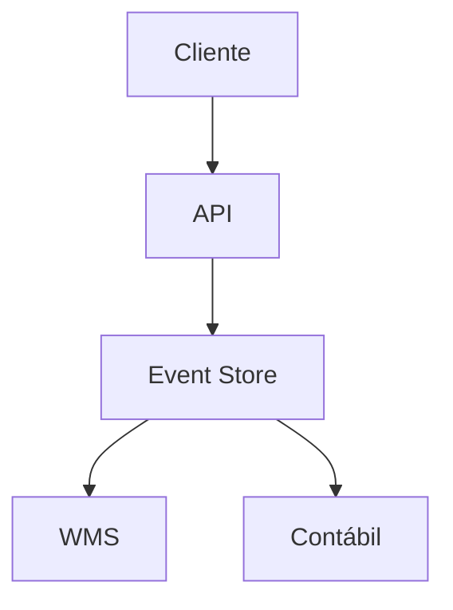

# Boas Práticas de Documentação - Jade-stock

**Versão:** 1.0  
**Data:** 2026-02-25  
**Aplicável:** Todo o projeto Jade-stock

---

## 🎯 Filosofia da Documentação

> **"Documentação é código vivo"** - Ela evolui junto com o software, não é um artefato estático.

### Princípios Fundamentais
1. **Clareza antes de otimização prematura**
2. **Automação em todo pipeline crítico**
3. **Documentação como código vivo**
4. **Testes como rede de segurança**
5. **Eventos como cola do sistema**

---

## 📋 Estrutura Padronizada

### Front Matter Obrigatório
Todo documento Markdown deve conter:

```markdown
# Título do Documento

**Data:** YYYY-MM-DD  
**Status:** [rascunho|revisão|aprovado|obsoleto]  
**Versão:** X.Y  
**Responsável:** [nome/equipe]

---

## 📋 Resumo Executivo
[Parágrafo de 2-3 linhas resumindo o propósito]

---

## 🎯 Público-Alvo
- **Para quem:** [Desenvolvedores|Produto|Operação|Todos]
- **Pré-requisitos:** [conhecimentos necessários]
- **Tempo estimado de leitura:** [minutos]

---

```

### Seções Padronizadas

#### 1. Documentos Técnicos
```markdown
## 🚀 Começo Rápido
## 🛠️ Pré-requisitos
## 📋 Estrutura
## 🔄 Fluxo de Trabalho
## 🧪 Testes
## 📊 Exemplos
## 🆘 Troubleshooting
## 📚 Referências
```

#### 2. Documentos de Negócio
```markdown
## 🎯 Objetivo
## 👥 Stakeholders
## 📋 Requisitos
## 🔄 Fluxos
## 📊 Métricas
## ⚠️ Riscos
## 🚀 Critérios de Sucesso
```

#### 3. Documentos de Arquitetura
```markdown
## 🏗️ Visão Geral
## 📊 Componentes
## 🔗 Integrações
## 🔄 Comunicação
## 📈 Escalabilidade
## 🔒 Segurança
## 🚀 Deploy
```

---

## 📝 Convenções de Escrita

### Linguagem
- **Português Brasileiro** para documentos de negócio
- **Inglês** para código e documentação técnica de API
- **Termos técnicos** em inglês com explicação em português
- **Consistência** em terminologia em todo o projeto

### Formatação
- **Títulos:** `#` `##` `###` hierárquicos
- **Ênfase:** `**negrito**` para termos importantes
- **Código:** `` `código inline` `` e ```código```blocos
- **Links:** `[texto descritivo](./caminho/relativo.md)`
- **Listas:** `-` para itens, `1.` para passos numerados

### Código e Exemplos
```python
# Sempre incluir linguagem no bloco de código
def exemplo_funcao(parametro: str) -> dict:
    """Exemplo bem documentado."""
    return {"resultado": parametro.upper()}
```

```bash
# Comandos shell com contexto
cd WMS
./scripts/run_api.sh  # Sobe API local
```

---

## 🗂️ Organização de Arquivos

### Nomenclatura
- **Nomes descritivos:** `guia_de_setup.md` (não `setup.md`)
- **Kebab-case:** `nome-de-arquivo.md`
- **Sem espaços:** usar hífens
- **Sem caracteres especiais:** evitar acentos e cedilha

### Estrutura de Diretórios
```
projeto/
├── README.md                 # Portal principal
├── DOCUMENTACAO.md           # Metadocumentação
├── DOCS_BOAS_PRACTICES.md    # Este documento
├── modulo/
│   ├── README.md            # Portal do módulo
│   ├── docs/                # Docs específicas
│   │   ├── 00_visao_geral.md
│   │   ├── 01_setup.md
│   │   └── 02_operacao.md
│   └── codigo/
└── archive/                  # Docs obsoletos
    └── historico/
```

### Numeração de Documentos
- **00_** para visão geral/mapa
- **01_** para setup/primeiros passos
- **02_** para operação diária
- **03_** para exemplos/casos de uso
- **NN_** para tópicos específicos

---

## 🔗 Referências Cruzadas

### Links Relativos
```markdown
# ✅ Bom - link relativo
Veja [guia de setup](./WMS/docs/01_setup.md) para detalhes.

# ❌ Ruim - link absoluto
Veja [guia de setup](/home/user/projeto/WMS/docs/01_setup.md).
```

### Âncoras Internas
```markdown
## 🚀 Começo Rápido {#comeco-rapido}

Veja a [seção de começo rápido](#comeco-rapido) para detalhes.
```

### Referências Externas
```markdown
[FastAPI Documentation](https://fastapi.tiangolo.com/)
[PostgreSQL Docs](https://www.postgresql.org/docs/)
```

---

## 📊 Diagramas e Visualizações

### ASCII Art (simples)
```
┌─────────┐    ┌─────────┐
│ Cliente │◄──►│  API    │
└─────────┘    └─────────┘
```

### Mermaid (complexo)


### Imagens
```markdown


*Figura 1: Visão geral da arquitetura Jade-stock*
```

---

## 🔄 Manutenção da Documentação

### Checklist de Atualização
- [ ] **Data** atualizada
- [ ] **Versão** incrementada
- [ ] **Status** revisado
- [ ] **Links** verificados
- [ ] **Exemplos** testados
- [ ] **Referências cruzadas** atualizadas

### Gatilhos de Atualização
- **Novo endpoint** → Atualizar API docs
- **Mudança de schema** → Atualizar Database docs
- **Novo módulo** → Criar documentação específica
- **Refatoração** → Atualizar arquitetura
- **Bug fix** → Atualizar troubleshooting

### Revisão Periódica
- **Semanal:** Verificação de links quebrados
- **Mensal:** Revisão de documentos ativos
- **Trimestral:** Auditoria completa da documentação
- **Semestral:** Arquivamento de documentos obsoletos

---

## 📈 Métricas de Qualidade

### Indicadores
- **Cobertura:** % de módulos documentados
- **Atualidade:** % de docs com status "aprovado"
- **Usabilidade:** Feedback dos usuários
- **Consistência:** Formato padronizado

### Metas
- **Cobertura:** ≥ 85%
- **Atualidade:** ≥ 90%
- **Consistência:** ≥ 95%
- **Links quebrados:** 0%

---

## 🛠️ Ferramentas Automáticas

### Validação de Links
```bash
# Verificar links quebrados
find . -name "*.md" -exec markdown-link-check {} \;
```

### Lint de Markdown
```bash
# Padronizar formato
markdownlint *.md --fix
```

### Geração de Índice
```bash
# Gerar TOC automático
doctoc README.md
```

---

## 🚀 Templates

### Template de Documento Técnico
```markdown
# [Título]

**Data:** YYYY-MM-DD  
**Status:** rascunho  
**Versão:** 1.0  
**Responsável:** [nome]

---

## 📋 Resumo Executivo
[Breve descrição do propósito e escopo]

---

## 🎯 Público-Alvo
- **Para quem:** [perfil]
- **Pré-requisitos:** [conhecimentos]
- **Tempo estimado:** [minutos]

---

## 🚀 Começo Rápido
[Passos iniciais]

---

## 🛠️ Pré-requisitos
[Dependências e configurações]

---

## 📋 Estrutura
[Organização do componente]

---

## 🔄 Fluxo de Trabalho
[Processos e operações]

---

## 🧪 Testes
[Como testar]

---

## 📊 Exemplos
[Exemplos práticos]

---

## 🆘 Troubleshooting
[Problemas comuns e soluções]

---

## 📚 Referências
[Links úteis e documentos relacionados]

---

## 🔄 Histórico de Alterações

| Data | Versão | Autor | Alteração |
|------|--------|-------|-----------|
| YYYY-MM-DD | 1.0 | [nome] | Criação inicial |
```

---

## 📋 Processo de Revisão

### 1. Criação
- Escolher template adequado
- Preencher seções obrigatórias
- Adicionar front matter

### 2. Revisão Técnica
- Verificar acuracidade técnica
- Testar exemplos e comandos
- Validar links e referências

### 3. Revisão de Conteúdo
- Clareza e objetividade
- Formatação padronizada
- Linguagem consistente

### 4. Aprovação
- Status alterado para "aprovado"
- Versão incrementada se necessário
- Notificação de atualização

---

## 🚨 Erros Comuns a Evitar

### ❌ Não Fazer
- Documentação desatualizada
- Links quebrados
- Exemplos que não funcionam
- Terminologia inconsistente
- Documentos sem data/versão
- Referências circulares

### ✅ Fazer Sempre
- Manter documentação sincronizada com código
- Testar todos os exemplos
- Usar linguagem inclusiva
- Adicionar data de atualização
- Revisar links regularmente
- Obter feedback dos usuários

---

## 📚 Recursos Adicionais

### Guias Externos
- [Google Technical Writing Courses](https://developers.google.com/tech-writing)
- [Microsoft Writing Style Guide](https://docs.microsoft.com/en-us/style-guide/)
- [Markdown Guide](https://www.markdownguide.org/)

### Ferramentas
- **Mermaid:** Diagramas
- **Doctoc:** Geração de TOC
- **Markdownlint:** Linting
- **markdown-link-check:** Validação de links

---

**Este documento é vivo** • Contribua através de PRs  
**Última atualização:** 2026-02-25 • **Versão:** 1.0
